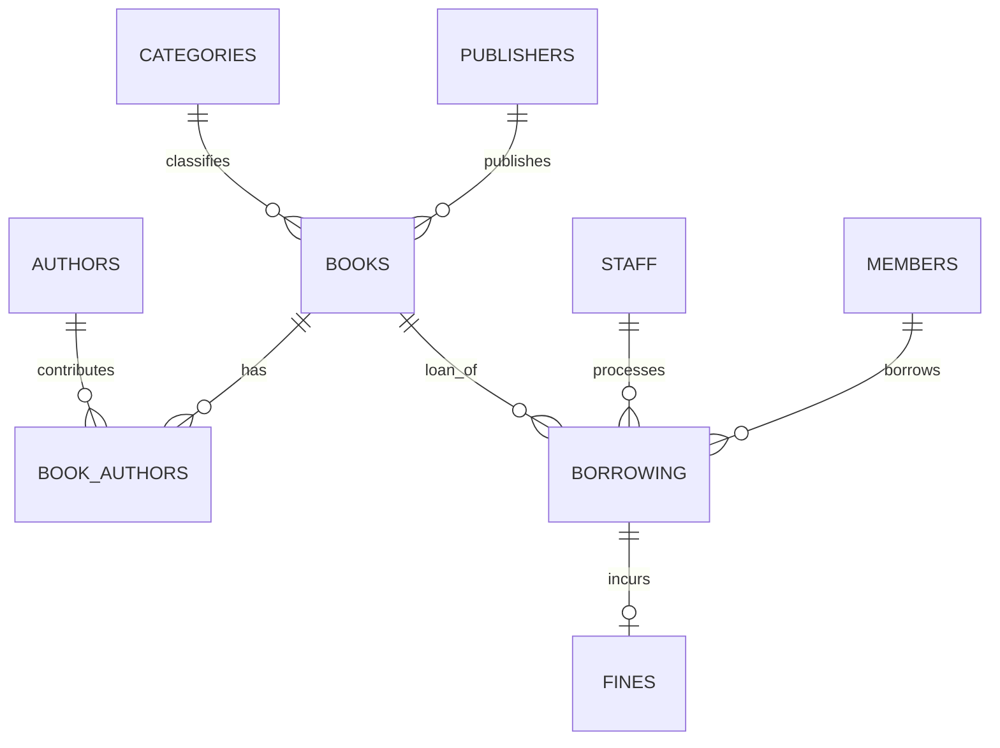

# Integrated Library Management System

A database design and implementation project built with **Oracle Database 10g** and **SQL*Plus**. The system models the full library workflow: publishers, categories, authors, books, members, staff, borrowing transactions, and late-return fines.

## Project Highlights

- Designed a normalized relational schema with **9 tables**
- Implemented **one-to-many**, **many-to-many**, and optional **one-to-one** relationships
- Used **primary keys, foreign keys, NOT NULL, UNIQUE, CHECK, and DEFAULT constraints**
- Added sample data for realistic library operations
- Wrote SQL using filtering, sorting, functions, aggregation, joins, and subqueries
- Created reusable **views** for overdue books and the book catalog
- Implemented **PL/SQL procedures and functions**
- Included basic privilege management with **GRANT / REVOKE**

## Entity Relationship Diagram

A standalone SVG version is available in [`diagrams/erd.svg`](diagrams/erd.svg).


The same core relationships can also be viewed directly on GitHub through Mermaid:



## Database Structure

The schema contains:

- `PUBLISHERS`
- `CATEGORIES`
- `AUTHORS`
- `BOOKS`
- `BOOK_AUTHORS`
- `MEMBERS`
- `STAFF`
- `BORROWING`
- `FINES`

### Main Relationships

- Publishers → Books: **1:N**
- Categories → Books: **1:N**
- Books ↔ Authors: **N:M** through `BOOK_AUTHORS`
- Members → Borrowing: **1:N**
- Staff → Borrowing: **1:N**
- Books → Borrowing: **1:N**
- Borrowing → Fines: **1:0..1**

## Repository Structure

```text
integrated-library-management-system/
├── README.md
├── diagrams/
│   ├── erd.svg
│   └── erd.jpg
└── sql/
    ├── 01_schema.sql
    ├── 02_queries.sql
    ├── 03_views.sql
    ├── 04_plsql.sql
    ├── 05_privileges.sql
    └── 06_sample_data.sql
```

## Running the Project

Run the scripts in this general order:

1. `sql/01_schema.sql` — creates the tables and constraints.
2. `sql/06_sample_data.sql` — inserts the demonstration dataset.
3. `sql/03_views.sql` — creates the reusable views.
4. `sql/04_plsql.sql` — creates the PL/SQL procedure and function.
5. `sql/02_queries.sql` — contains sample queries to explore the database.
6. `sql/05_privileges.sql` — demonstrates role and privilege management; some statements require a suitably privileged Oracle account.

## Sample Dataset

The included sample data demonstrates:

- Multiple publishers, categories, authors, and books
- A many-to-many relationship between books and authors
- Regular, Student, and VIP members
- Staff members responsible for borrowing transactions
- Returned, overdue, and currently borrowed books
- Paid and unpaid late-return fines

Borrowing dates use `SYSDATE` offsets so the dataset continues to include meaningful active and overdue examples whenever it is run.

## Technologies

- Oracle Database 10g
- SQL
- PL/SQL
- SQL*Plus
- Relational Database Design
- ERD / Normalization

## Notable Features

### Borrowing Procedure
`SP_BORROW_BOOK` checks whether a book is available, locks the selected book row, creates the borrowing transaction, and decreases the available-copy count.

### Fine Calculation Function
`FN_CALC_FINE` calculates the number of late days and applies a fine of **0.5 JOD per day**.

## Author

**Aba-al-Hasan Al-Mahariq**  
Software Engineering Graduate — Zarqa University
